# App reversing - Have a smiley day! :)

## Part 1

A secondary phone was found in KALLESTAD, Jesper's boat.
Data was successfully extracted from the phone, but nothing incriminating was found.

Officers did however come accross this strange app which seemingly serves no purpose.
The app cannot be found on the app store, so it may be worth taking a look at.

Reverse engineer the app ``smiley_day.apk`` to see if any hidden functionality may be uncovered.

Flag format: lowercase_letters_seperated_by_underscores

Note: If you encounter the following error: "Unable to determine ClassLinker field offsets". Please try running the app in an emulator with an older API version, such as API 30. You may also try to create an emulator that does not have Google Play if you still have issues.

## Part 2

Keep digging through the Smiley Day app and crack the password to unlock the secret data.

Note: It is neither neccessary nor feasible to perform online brute force of the password.

Flag format: The password itself is the flag for this challenge.


Table of Contents
=================

* [Quick walkthrough](#quick-walkthrough)
   * [Flag 1 - Quick](#flag-1---quick)
   * [Flag 2 - Quick](#flag-2---quick)
      * [Flag 2 - Alternative solution](#flag-2---alternative-solution)
* [Detailed Walkthrough](#detailed-walkthrough)
   * [Flag 1 - Detailed](#flag-1---detailed)
      * [First look](#first-look)
      * [Next steps - NothingToSeeHereActivity](#next-steps---nothingtoseehereactivity)
         * [Enabling the SeekBar](#enabling-the-seekbar)
         * [Creating our hook](#creating-our-hook)
         * [Running our hook](#running-our-hook)
         * [The source of the error message](#the-source-of-the-error-message)
   * [Flag 2 - Detailed](#flag-2---detailed)
      * [ValidatePasswordActivity - Password validation](#validatepasswordactivity---password-validation)
         * [Looking under the hood - PasswordUtils](#looking-under-the-hood---passwordutils)
         * [Crash course in AES/CFB](#crash-course-in-aescfb)
         * [First block](#first-block)
         * [Single-segment reused key attack](#single-segment-reused-key-attack)
         * [Next segments](#next-segments)
         * [Proof of concept](#proof-of-concept)
      * [Solution 1 - Standard reused key attack](#solution-1---standard-reused-key-attack)
      * [Solution 2 - Pretty fast brute force](#solution-2---pretty-fast-brute-force)
         * [Why it works](#why-it-works)
      * [Revealing the plans](#revealing-the-plans)


# Quick walkthrough

See the next section for more details regarding each point, including the scripts used. This is simply meant as a very quick summary of the challenge.

## Flag 1 - Quick

Looking up the main activity of the app, we can see that the developers left debug mode enabled. Debug mode simply loads frida-gadget.

Next, we are shown a screen with a smiley face. The eyes of the smiley are buttons, and when you press them, the string "left" or "right" is added to an ``ArrayList`` depending on which eye you press. Clicking an eye compares this ``ArrayList`` with the result of a method, and if they are equal, a secret is activated. Calling this method using frida reveals that the code is ``left,left,left,left,left,right,right,right,left,left,left,left,right``. 

Clicking the eyes in this order turns the mouth of the smiley into a ``SeekBar``, but swiping the ``SeekBar`` simply makes the app close with an error message saying that cops are not allowed. After looking up this string we can see that the next activity verifies our state by running certain queries against our phone. We can hook this method with frida, and change its return value to let us through.

This allows us to continue to the next activity, where the first flag is visible.

## Flag 2 - Quick

The next activity is a password prompt. Looking into the password verification code and using frida to read an encrypted error message we can see that the developers migrated the code to the cloud, so the password is not stored on the phone anymore. Calling the new method using frida shows us that the password that we enter is sent to an online API, and we get two hexstrings back which are then compared with each other.

The old code is still there however, and we can see that the correct password, as well as the password we submit, were both encrypted using an obfuscated cryptographic algorithm using the same securely random IV and key, and the ciphertexts are then compared. Using frida we can call the deobfuscation method to let us know that the algorithm in use is AES/CFB. 

This setup is vulnerable due to the same keystream being used for both passwords, and we can use a standard [reused key attack](https://en.wikipedia.org/wiki/Stream_cipher_attacks#Reused_key_attack) to crack the password. We also have control over one of the plaintexts, making the solution computationally trivial. This lets us crack the password using only a single request per segment of ciphertext:


This script can be found [here.](#Solution-1---Standard-reused-key-attack)

This password is the flag, but the password can also be entered to get the suspect's TODO list, which contains some story flavor as well as some minor hints regarding other challenges in the ctf.

### Flag 2 - Alternative solution

Alternatively, you might notice from just messing around with the algorithm that if you have a correct character in the correct location, then that byte will be the same in both ciphertexts (while taking segments/blocks into account). This is really just the same reused key attack in disguise, but it allows you to bruteforce each segment very quickly:


This script can be found [here.](#solution-2---pretty-fast-brute-force)

# Detailed Walkthrough

While this is roughly the intended solution, keep in mind that there is often more than one way to solve these types of challenges. Especially when you involve dynamic instrumentation like we do here.

Take the following as a suggestion, rather than a "correct" route to the goal.

## Flag 1 - Detailed

### First look

Installing the app in an emulator or on a phone and running it shows us a screen with a smiley face, and not much else. If we click on the eyes we can make the smiley face wink and give us a cheery message, but there doesn't appear to be much else to see here at first glance.

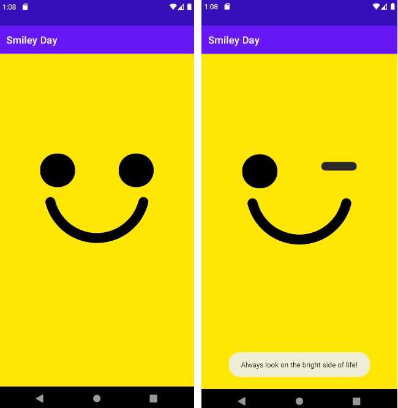

Open up the apk in your favorite android decompiler. We will be using [jadx](https://github.com/skylot/jadx) in this walkthrough, but keep in mind that your output may look different if you are using something else, or even if you just have different settings. 

Start by taking a look at ``AndroidManifest.xml``. We can see that the initially launched activity is ``org.mothra.smiley_day.MainActivity``:

``` xml
<activity android:label="@string/fake_app_title" 
    android:name="org.mothra.smiley_day.MainActivity" 
    android:exported="true">
    <intent-filter>
        <action android:name="android.intent.action.MAIN"/>
        <category android:name="android.intent.category.LAUNCHER"/>
    </intent-filter>
</activity>
```

Navigating to MainActivity, we can see that it is a very simple class. It shows us the first oopsie committed by the devs, in which they left debug mode enabled on the app:


``` java
public class MainActivity extends ActivityC0121e {
    private static void setDebugMode(boolean z) {
        if (z) {
            System.loadLibrary("frida-gadget-15.1.28");
        }
    }

    public void onCreate(Bundle bundle) {
        Log.d("smileyDay", "TODO: Turn off debug mode before release");
        setDebugMode(true);
        ...
```

We can see that debug mode simply loads [frida-gadget](https://frida.re/), which is a pretty clear indicator that we are expected to make use of dynamic instrumentation during this challenge.

----
**NOTE**

Normally you would need to run frida yourself, which is _usually_ achieved by one of these methods:
   
- Rooting your phone/emulator and running frida-server on it.
- Injecting a frida-gadget loadLibrary call similar to the one above into your target app.
- Injecting frida-gadget as a new dependency into an existing native library import in your target app.

----

After loading frida the app opens ``NothingToSeeHereActivity``, which appears to be our smiley face.

### Next steps - ``NothingToSeeHereActivity``

The xml-file defining the layout can be seen in the ``setContentView``-call in the ``onCreate``-method, which is ``E.xml`` in this case:

``` java
public void onCreate(Bundle bundle) {
    super.onCreate(bundle);
    setContentView(C5354R.layout.E);
    m271r0();
}
```

Navigating to this file reveals that the activity contains two buttons, which is likely the winking eyes. It also contains something called an ``ArcSeekBar`` from a third party library.
A ``SeekBar`` is just a standard android UI element though: it is a bar you can swipe, so this is probably just a fancy variant of that (this can easily be confirmed via your favorite search engine if you want to be sure). 

``` xml
<?xml version="1.0" encoding="utf-8"?>
<androidx.constraintlayout.motion.widget.MotionLayout ...>
    <Button .../>
    <Button .../>
    <com.marcinmoskala.arcseekbar.ArcSeekBar app:enabled="false" .../>
</androidx.constraintlayout.motion.widget.MotionLayout>
```

The ``ArcSeekBar`` is currently disabled, so we probably want to turn it on somehow. 

#### Enabling the ``SeekBar``

Going back to the java class we can see that the ``ArcSeekBar`` is enabled when the ``activateSecret``-method is called.

``` java
private void activateSecret() {
    ArcSeekBar arcSeekBar = (ArcSeekBar) findViewById(C5354R.C5357id.A4);
    arcSeekBar.setEnabled(true);
    arcSeekBar.setProgress(0);
}
```

The ``activateSecret``-method is called in the ``onClick``-listeners for each button, but only if a certain method returns true. We can also see that clicking a button appears to add either the string "left" or "right" respectively to an ArrayList.

``` java
public /* synthetic */ void m295o0(MotionLayout motionLayout, ArcSeekBar arcSeekBar, View view) {
    m292r0();
    f31333G.add("left");
    motionLayout.m21728N0(C5354R.C5357id.end);
    motionLayout.m21690g1(C5354R.C5357id.N3);
    if (m290t0()) {
        activateSecret();
    } else if (arcSeekBar.isEnabled()) {
        arcSeekBar.setEnabled(false);
        arcSeekBar.setProgress(0);
    }
}
```

Taking a look at the method that needs to return true we can see that it compares the aforementioned ArrayList with the output from yet another method.
This method appears to base64-decode a byte array, before doing some XORing and other garbage we don't really want to deal with.

``` java
/* renamed from: n0 */
public static final String m296n0() {
    byte[] decode = Base64.decode(f31334H, 0);
    byte[] bArr = new byte[decode.length];
    for (int i = 0; i < decode.length; i++) {
        byte b = decode[i];
        int[] iArr = f31335I;
        bArr[i] = (byte) (b ^ (iArr[i % iArr.length] / 2));
    }
    return Utils.RSA8092BitDecrypt(new String(bArr, StandardCharsets.UTF_8));
}
```

Thankfully, we _don't_ have to deal with it. Recall that we observed that frida-gadget was already loaded in the beginning of the app. Taking a look at the results from methods such as this is the perfect job for frida.

----

**NOTE**

You should probably be renaming variables, functions, methods and so on when you discover what they actually mean, do and represent. For the sake of brevity we will not be doing that in this walkthrough.

----

#### Creating our hook

In jadx there is an option to copy a method/class/member etc. as a frida function. To do this simply right click the method name, and click ``Copy as frida snippet``. You can also just click the method name and click the f key if you prefer.

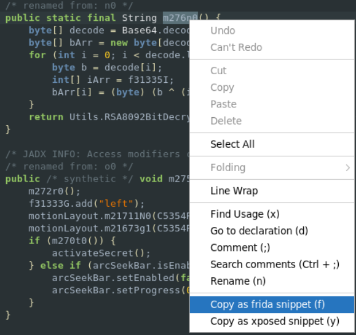

By default, these snippets create a hook into the function that lets you know that the function has been called, and then tells you the result of the function, which happens to be exactly what we're after (it's almost as if someone planned this).

The frida hook does need to be surrounded by a ``Java.perform()`` however, as this lets frida know that we want to make use of java classes in this hook.

We paste the following code to a file called ``get_key.js``:

``` javascript
Java.perform(function (){
    let NothingToSeeHereActivity = Java.use("org.mothra.smiley_day.NothingToSeeHereActivity");
    NothingToSeeHereActivity.n0.implementation = function(){
        console.log('n0 is called');
        let ret = this.n0();
        console.log('n0 ret value is ' + ret);
        return ret;
    };
});
```

#### Running our hook

We can then run this code with frida to activate our hook. This code will not actually call the method in question however, but as we saw previously this method is called every time one of the buttons/eyes are clicked, so we simply load the hook and click an eye:

``` bash
$ adb devices
List of devices attached
emulator-5554   device

$ frida-ps -D emulator-5554 | grep -i smiley
28342  Smiley Day

$ frida -D emulator-5554 -l scripts/get_key.js "Smiley Day"
     ____
    / _  |   Frida 15.1.8 - A world-class dynamic instrumentation toolkit
   | (_| |
    > _  |   Commands:
   /_/ |_|       help      -> Displays the help system
   . . . .       object?   -> Display information about 'object'
   . . . .       exit/quit -> Exit
   . . . .
   . . . .   More info at https://frida.re/docs/home/

[Android Emulator 5554::Smiley Day]-> n0 is called
n0 ret value is left,left,left,left,left,right,right,right,left,left,left,left,right
```

We can see that the output of this method is 
``left,left,left,left,left,right,right,right,left,left,left,left,right``, which will then be compared to the array which keeps the state of the buttons we have pressed. From this we can deduce that we need to press the left eye 5 times, followed by the right eye 3 times, then the left eye 4 more times, and finally the right eye once.

Pressing this key sequence does indeed activate the ``ArcSeekBar``. Note that the mouth now has a blue dot on it that we can drag:

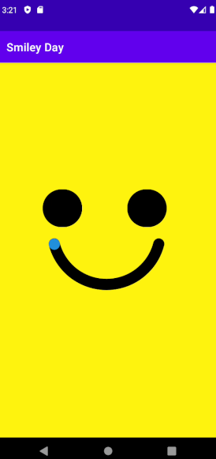

With the ``ArcSeekBar`` activated we are one step closer to cracking the case!

----

**NOTE**

This particular function is fairly reasonable to reverse engineer statically, as it just ends up being Base64Decode -> XOR -> rot13. In many cases, however, such methods will be significantly more obfuscated and hard to deal with. Always keep dynamic instrumentation in mind in these cases.

Of course, even if you don't have something like frida to help you out, you can always just copy the relevant methods into your own file. You can then just compile and run this file to get the output. This can get really complicated really quickly though, so dynamic tends to be the way to go. 

You also need to be aware of potential differences between android java and non-android java if you want to take this approach directly on a computer.

----


### ``ValidatePasswordActivity`` - Cop detection bypass

When we drag the ``ArcSeekBar`` to the other side, the app unfortunately closes with an error message (which one you get depends on how you are running the app):


While we will not be discussing the accuracy of that statement, the fact that the app denies us further access is indeed problematic.

With any luck we will be able to search for this string though, to see where it is used.

#### The source of the error message

The string is indeed stored in plaintext in ``strings.xml``, and we can only find one reference to it; in ``ValidatePasswordActivity``.

The string is referenced in a method which is called by the activity's ``onCreate``-method.

``` java
/* renamed from: l0 */
private boolean m266l0() {
    Context applicationContext;
    int i;
    if (Utils.isRunningOnEmulator()) {
        applicationContext = getApplicationContext();
        i = C5354R.string.emulator;
    } else if (Utils.isRunningOnCriminalCryptoPhone()) {
        return false;
    } else {
        applicationContext = getApplicationContext();
        i = C5354R.string.non_cryptophone;
    }
    Toast.makeText(applicationContext, i, 1).show();
    return true;
}

public final void onCreate(Bundle bundle) {
    ...
    super.onCreate(bundle);
    setContentView(C5354R.layout.C);
    if (m266l0()) {
        finishAndRemoveTask();
        return;
    }
    ...
```

It seems like the method checks for certain things, such as if we are running on an emulator, if we are running on a "criminal cryptophone", etc. And if it doesn't like our state the method will return true, which causes the app to close.

Incidentally, another thing frida is quite good at is changing the results of function- and method calls. We will do this quite similarly to how we got the key to the smiley face, but this time we will change what the function returns.

We do the same "copy as frida snippet" thing as we did before, only this time we set the function to always return false:

``` javascript
Java.perform(
    function (){
        let ValidatePasswordActivity = Java.use("org.mothra.smiley_day.ValidatePasswordActivity");
        ValidatePasswordActivity.l0.implementation = function(){
            console.log('Bypassing cop detection!');
            return false;
        };
    });
```

We can now run this script and try to activate the ``ValidatePasswordActivity`` again:

``` bash
$ frida -D emulator-5554 -l scripts/bypass_detection.js "Smiley Day"
     ____
    / _  |   Frida 15.1.8 - A world-class dynamic instrumentation toolkit
   | (_| |
    > _  |   Commands:
   /_/ |_|       help      -> Displays the help system
   . . . .       object?   -> Display information about 'object'
   . . . .       exit/quit -> Exit
   . . . .
   . . . .   More info at https://frida.re/docs/home/

[Android Emulator 5554::Smiley Day]-> Bypassing cop detection!
```

We can see that this worked perfectly, and we are greeted with a password prompt plus the first flag in the upper left corner:

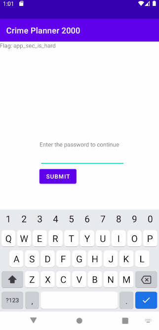

Congratulations if you made it this far! We are not done yet however.

## Flag 2 - Detailed

### ``ValidatePasswordActivity`` - Password validation

After just randomly testing a few passwords to see how the activity behaves we get an interesting error message:

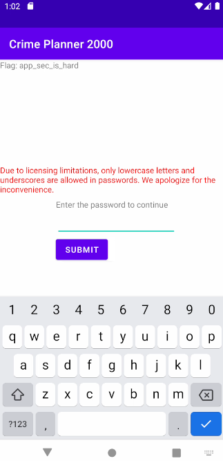

Limitations like these can be quite helpful in case we need to perform some form of brute forcing of the password, but also to potentially verify our findings. This could also be a hint from the really smart, handsome and cool guy who made the challenge, or it could just be a red herring. We'll make a note of this for now, but there is not much we can do with this information yet.

#### Looking under the hood - ``PasswordUtils``

We can see in jadx that when the submit button is pressed, the actual validation of the password is passed off to the ``validatePassword``-method in the ``PasswordUtils`` class.

This method calls another method called ``validatePasswordNew``. We can also see that there is another method called ``validatePasswordOld`` in this class, which is not called by anything. Older versions of code being left in place is quite common in certain cases, to support older versions of the app for example. In this case though the code is not reachable anymore and probably should have been removed.

``` java
private static boolean validatePasswordOld(byte[] bArr) throws Exception {
    byte[] correctPassword = getCorrectPassword();
    SecureRandom secureRandom = new SecureRandom();
    byte[] bArr2 = new byte[32];
    byte[] bArr3 = new byte[16];
    secureRandom.nextBytes(bArr2);
    secureRandom.nextBytes(bArr3);
    try {
        return Arrays.equals(encrypt(bArr2, bArr, bArr3), encrypt(bArr2, correctPassword, bArr3));
    } catch (Exception e) {
        e.printStackTrace();
        return false;
    }
}
```

The ``getCorrectPassword``-method certainly seems juicy, but when we look into it it seems its contents have been replaced with an exception:

``` java
private static byte[] getCorrectPassword() throws Exception {
    throw new Extras.DeprecatedException(Utils.decryptStandardString(App.m279b(C5354R.string.get_stored_deprecated_enc)));
}
```

The exception message appears to be encrypted in ``strings.xml``, and is decrypted at runtime. We could reverse engineer this decryption method, or we could just hook into this method using frida. Frida supports calling methods directly, and since this is a static method we don't have to find a suitable object on the heap either:

``` javascript
Java.perform(function() {
    let PasswordUtils = Java.use('org.mothra.smiley_day.PasswordUtils');
    PasswordUtils.getCorrectPassword.call(PasswordUtils);
});
```

Running this script allows us to read the decrypted exception message:

``` 
$ frida -q -D emulator-5554 -l scripts/get_hint.js "Smiley Day"
Error: org.mothra.smiley_day.Extras$DeprecatedException: This USED to get the correct password from SharedPreferences, but then snoopy cops could just read the password directly from memory before we could encrypt it. To avoid this we have moved this logic to the cloud, so that only the encrypted form of the correct password is exposed to the app. Surely there is nothing else wrong with our logic.
    at <anonymous> (frida/node_modules/frida-java-bridge/lib/env.js:124)
    at value (frida/node_modules/frida-java-bridge/lib/class-factory.js:1065)
    at e (frida/node_modules/frida-java-bridge/lib/class-factory.js:586)
    at apply (native)
    at value (frida/node_modules/frida-java-bridge/lib/class-factory.js:970)
    at e (frida/node_modules/frida-java-bridge/lib/class-factory.js:553)
    at call (native)
    at <anonymous> (/get_hint.js:3)
    at <anonymous> (frida/node_modules/frida-java-bridge/lib/vm.js:12)
    at _performPendingVmOps (frida/node_modules/frida-java-bridge/index.js:250)
    at <anonymous> (frida/node_modules/frida-java-bridge/index.js:225)
    at <anonymous> (frida/node_modules/frida-java-bridge/lib/vm.js:12)
    at _performPendingVmOpsWhenReady (frida/node_modules/frida-java-bridge/index.js:244)
    at perform (frida/node_modules/frida-java-bridge/index.js:204)
    at <eval> (/get_hint.js:4)
```

It appears that the old strategy was to store the correct password on the phone, and then encrypt it as well as the password we just entered and compare the ciphertexts. With the code handling this logic moved off-device however we will have to analyze the code and strategy that they are using and see if we can spot any errors.

First, let's take a look at what the cloud API is actually returning. We can once again do this by simply calling the relevant function using frida. Note that we are transforming the javascript string into a java ``String``-object. This is not strictly neccessary in this particular case, but in general it depends on what your target method is doing to the string, and it doesn't hurt so why not:

``` javascript
Java.perform(function() {
    let PasswordUtils = Java.use('org.mothra.smiley_day.PasswordUtils');
    let JavaString = Java.use('java.lang.String');

    for(let i = 1; i <= 3; i++) {
        let javaString = JavaString.$new("test" + "a".repeat(i));
        console.log(PasswordUtils.getEncryptedPasswordsFromCloud.call(PasswordUtils, javaString));
        console.log(PasswordUtils.getEncryptedPasswordsFromCloud.call(PasswordUtils, javaString));
    }
});
```

The script just tries the passwords ``testa``, ``testaa`` and ``testaaa`` twice each. Running this gives us the following output:

``` bash
$ frida -q -D emulator-5554 -l scripts/request.js "Smiley Day"
fc862e8b29,e582249d2d3147198c00b313c84d959c44770ab44fa92ead9920123e1cdedf08f1dd854fea898082de25417d2b
9331bec597,8a35b4d3933dd25730ae9193c5fe71104b867d9a1dc4949d202b501473e590bb0cb8aae1ac5966a163416373b8
bbfab09867ec,a2feba8e63d27ecb545c8e4424dd02b2ce54ec6eea956fda1351cc185767e3a8e5de08f854aed492a3b8a7e18e
3df591b8ee87,24f19baeeab94b8925b19e83a04e4efd3c1b28d723ad1e6725ab700689d8c8e7f7a11ae60e8598ebf3647731da
68968ede7b8a43,719284c87fb455a05510bac3990318d2041f22fac91f54cd867e29607799deb1e4aedde7c031c86e797c93234d
43388dcaec31aa,5a3c87dce80fbc13bdf8e5b7e082499fdd0b927f73a8325e2dcae2117ba31e2dc6b88e245f32a219a8fc43a864
```

The API is clearly returning two hexstrings, likely representing our submitted password and the correct password. We can see that sending the same string multiple times results in a different return value. We can also see that the length of what we get back matches exactly the length of what we put in(times two, since it's a hexstring).

The error message we just read did seem to imply that the same encryption scheme is still in use, and that the code has just been lifted to the cloud. We should therefore take a look at ``validatePasswordOld``, with the hopes that this code is mostly unchanged.

``` java
private static boolean validatePasswordOld(byte[] bArr) throws Exception {
    byte[] correctPassword = getCorrectPassword();
    SecureRandom secureRandom = new SecureRandom();
    byte[] bArr2 = new byte[32];
    byte[] bArr3 = new byte[16];
    secureRandom.nextBytes(bArr2);
    secureRandom.nextBytes(bArr3);
    try {
        return Arrays.equals(encrypt(bArr2, bArr, bArr3), encrypt(bArr2, correctPassword, bArr3));
    } catch (Exception e) {
        e.printStackTrace();
        return false;
    }
}

private static byte[] encrypt(byte[] bArr, byte[] bArr2, byte[] bArr3) throws ... {
    SecretKeySpec secretKeySpec = new SecretKeySpec(bArr, "AES");
    Cipher instance = Cipher.getInstance(getAlgorithm());
    instance.init(1, secretKeySpec, new IvParameterSpec(bArr3));
    return instance.doFinal(bArr2);
}
```

Taking a look at this method again, and looking up the java crypto methods in the official documentation, it seems that the app generates a random IV and key for use in the encryption using cryptographically secure randomization methods, so cracking these is probably not realistic.

It then encrypts both the correct password and our submitted password using the same key and IV. We would normally be able to just read what algorithm is in use in the ``Cipher.getInstance``-call, but the string seems to be obfuscated:

``` java
private static String getAlgorithm() {
    String str;
    StringBuilder sb = new StringBuilder();
    for (int i = 0; i < 17; i++) {
        if (i == ((int) Utils.eval("767 - (01350 + 0x24a) * 0b101111000 / 0b1010010010"))) {
            str = "(0x234 / (0b101000000 / (0b100010000 - (524 - 0x100)) - 68)) ";
        } else if (i == ((int) Utils.eval("(01035 + 0x15f + 0b10111100) / 0x21c - (0b10010011 - 0x91)"))) {
            str = "(01236 - (0x2e7 - (0x12c - 0b10100010)))";
        } else if (i == ((int) Utils.eval("0x1e6 * (0x1a8 - 146) / (01070 - 0655) - 01676"))) {
            str = "(739 - (0x34c - (0x1b6 - (0x14f - (249 - 0x8e)))))";
        } else if (i == ((int) Utils.eval("(0x308 + 0600) / (898 - (01165 + 0b100101))"))) {
            str = "(0x25c - (01143 - (0530 - (423 - (0x22c - 0b110010000)))))";
        } else if (i == ((int) Utils.eval("(0b1010011111 + 0x158 + 0x80) / (0x23e - 0xc1)"))) {
            str = "(0b10111100 / (0b1000001000 - (0654 + 0b1011000)))";
        } else if (i == ((int) Utils.eval("((0x12e + 31) * 0b1111 - (387 - 0x75)) / 0x13b"))) {
            str = "(01405 - (0x3b4 - (484 - (0x146 - 127))))";
        } else if (i == ((int) Utils.eval("(0x219 - (0b110000010 - (0x154 - 331))) / 0x10"))) {
            str = "(0b1110110101 - (0x321 + (0b1110100011 + 0x2ab + 0b100100010) / 034))";
        } else if (i == ((int) Utils.eval("0b1011000111 - (681 + 0b11101)"))) {
            str = "((0x208 - (0x5f - 13)) * (0b1111100000 - 01450) / (0x30f + 0b110000001))";
        } else if (i == ((int) Utils.eval("(823 - (692 - 0x6d)) / (0b101011 - 3)"))) {
            str = "((0x10f - 0b11011011) * 0b101111 - (01621 + 784) - (0x1f5 + 0264))";
        } else if (i == ((int) Utils.eval("0b1011111101 / (0x25e - (827 - (0b1111010011 - 0x2a1)))"))) {
            str = "(302 - (01277 - (0272 + 0254) - (0144 + 066)))";
        } else if (i == ((int) Utils.eval("034 - (0x2ce + 0707) / (676 - (01415 - 0xae))"))) {
            str = "(0b101011110 - (539 - (0433 + 0644 / (119 + 21))))";
        } else if (i == ((int) Utils.eval("(997 - (0b1101101100 - 01551) + 94) / (0b11101001 - 0b1100001)"))) {
            str = "(0xb4 - 0b111001011 * 200 / (01203 + 0x101))";
        } else if (i == ((int) Utils.eval("(0xd9 - (0x223 - (01643 - (222 + 0301)))) / 93"))) {
            str = "(0641 - (620 - (0562 - (78 + 06))))";
        } else if (i == ((int) Utils.eval("(0b1100100111 - (01557 - 0x198)) / (869 - 0x349)"))) {
            str = "(01401 - (0x2b8 - (0237 - 132)))";
        } else if (i == ((int) Utils.eval("(01464 - (0x361 - 0x5d)) / (964 - (0x3e0 - 0b11111))"))) {
            str = "((01075 * (0b1010111111 - 0b1000001111) - (01551 - 01367)) / (0x368 + 0x6a))";
        } else if (i == ((int) Utils.eval("230 - ((0b1100101100 - 0xab) * 0b101011 + 0b111001101) / 0b1111100"))) {
            str = "(0b111010 + 01474 / (776 - (0x247 + 101)))";
        } else if (i == ((int) Utils.eval("(0b1011011110 - (0b111000010 + 0x32)) / (0b110101010 - (0x2cf - 311))"))) {
            str = "(0b1000011101 - (0b1011000011 - (884 - (0b1010001110 - 36))))";
        }
        sb.append((char) Utils.eval(str));
    }
    return sb.toString();
}
```

This looks incredibly annoying to work out by hand, so we will just use frida again:

``` javascript
Java.perform(function() {
    let PasswordUtils = Java.use('org.mothra.smiley_day.PasswordUtils');
    console.log(PasswordUtils.getAlgorithm.call(PasswordUtils));
});
```

``` bash
$ frida -q -D emulator-5554 -l scripts/get_encryption_algorithm.js "Smiley Day"
AES/CFB/NoPadding
```

### ``PasswordUtils`` - Cracking the password

It seems that AES/CFB is used to encrypt the passwords before comparing them. Generally you would want to use a slow hashing algorithm, rather than encryption to secure passwords. And you certainly wouldn't store the password in plaintext either, but rather just store the hash.

This particular setup is quite bad, but the key to cracking the password will be their misuse of AES/CFB, as we will see in the following sections.

#### Crash course in AES/CFB

Here is an outline of how CFB encrypts a plaintext (thanks to whoever uploaded this to wikipedia):

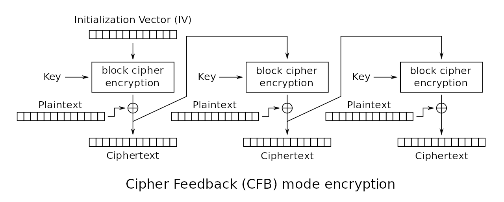

The algorithm is a block cipher algorithm, meaning it splits the plaintext into equal sized _blocks_, and then performs some cryptographic operations on these blocks sequentially, and each block depends on the block preceding it in some way.

The block size in AES is always 16, but CFB effectively works as a _stream cipher_, which means it also gets to set a ``segment size``. _For the purposes of this_ you can think of it as the block size being settable essentially. 

Java uses 16 bytes by default for the segment size as well, but there are other exceptions. The popular python library ``pycryptodome`` uses 1 byte as the default value for instance, and you can theoretically set it to any _bit_ value you want.
Since the error message we saw earlier said that the java code was replicated in the cloud we will assume a segment size of 16 bytes.

#### First block

Let's focus on just the first block for now:

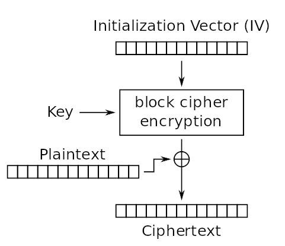

Every block works like this, but with the IV being replaced with the ciphertext from the previous block for every block other than the first one (hence the name _initialization_ vector - as the first block has no ciphertext to use). 

As you can see, the CFB algorithm performs the actual encryption not on the plaintext itself, but on the initialization vector using the key. It then XORs this encrypted blob(which is now effectively random unless you know the IV and key) with the plaintext, giving us the ciphertext for this block.

Consider the implications of this; Unlike in something like AES/CBC, in CFB the plaintext does _not_ affect the actual randomness of the ciphertext itself, it relies on the encryption done beforehand for that.

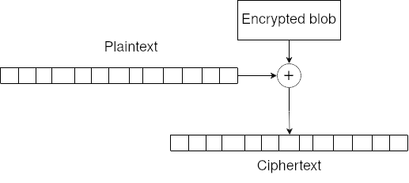

We can send it a bunch of the same character, and get a bunch of unreadable garbage out:

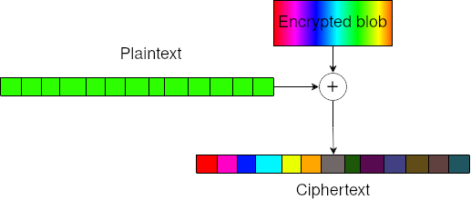

But consider what happens if we change only 1 character in our plaintext while using the same encrypted blob; only the character in the same position changes in the ciphertext:

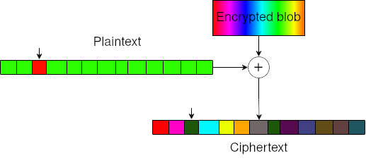

Now, the key and the IV change each time, which means that the encrypted blob, or ``keystream``, also changes each time. We also have no way to crack the key or IV. We do however get one use of the same keystream against both the correct password and our chosen password. This means that their random element is the same, which effectively means that they are _not_ random _relative to each other_; the ciphertexts are linearly related via their respective plaintexts.

This fact is what we will exploit, using what is known as a [reused key attack.](https://en.wikipedia.org/wiki/Stream_cipher_attacks#Reused_key_attack)

#### Single-segment reused key attack

Consider our scenario where we have made 1 request. Let's define our plaintexts and our keystream like this (for a single segment):

$P_1 = Correct\ password$

$P_2 = Submitted\ password$

$K_1 = Keystream\ (Encrypted\ blob)$

And we know that our ciphertexts are calculated as follows:

$C_1 = K_1 \oplus P_1$

$C_2 = K_1 \oplus P_2$

We know the values of $C_1$, $C_2$ and $P_2$, and we wish to find out what $P_1$ is.
We can use some fairly simple boolean algebra to solve for $P_1$. We begin by setting up the following equation, which is just XORing the two equations above:

$C_1 \oplus C_2 = (K_1 \oplus P_1) \oplus (K_1 \oplus P_2)$

XORing something with itself will always give 0, so the $K_1$ cancels itself out, and simplifies the equation to:

$C_1 \oplus C_2 = (\enclose{updiagonalstrike}{\enclose{downdiagonalstrike}{K_1}} \oplus P_1) \oplus (\enclose{updiagonalstrike}{\enclose{downdiagonalstrike}{K_1}} \oplus P_2)$

$C_1 \oplus C_2 = P_1 \oplus P_2$

And now we can simply XOR with $P_2$ on both sides to give us an equation for solving $P_1$:

$C_1 \oplus C_2 \oplus P_2 = P_1 \enclose{updiagonalstrike}{\enclose{downdiagonalstrike}{\oplus P_2 \oplus P_2}}$

$C_1 \oplus C_2 \oplus P_2 = P_1$

Which gives us our final equation:

$P_1 = C_1 \oplus C_2 \oplus P_2$

This allows us to solve the hidden plaintext $P_1$ of a segment instantly, as long as we know the values of $C_1$, $C_2$ and $P_2$, which we do.

#### Next segments

Going back to the original figure of how CFB works we can see that the ciphertext for each segment changes the keystream for the _next_ segment.


This means that if the ciphertexts for segment nr 1 are not equal, then the keystreams for the next segment will also be different. This means that the ciphertexts for segment nr 2 are not linearly related to each other anymore, as they now have different keystreams, and our equation for solving the secret plaintext will no longer work.

This is not much of a problem however, as all we have to do is ensure that our keystream for segment nr 2 matches the keystream for segment nr 2 in the correct password. We achieve this by ensuring that both ciphertexts match in segment nr 1, by providing the correct plaintext for this segment.

That is we work on one segment at a time, starting from the front, and then send our uncovered password segments followed by the dummy text we want to use. This ensures that both the correct password and our chosen password will get the same keystream for segment nr 2, then 3 and so on.

For example, let's say the segment size is 3, and we discovered that the correct first segment is ``mno`` using our controlled plaintext ``aaa``. We could then solve segment nr 2 by sending ``mnoaaa`` for example.

#### Proof of concept

Let's go back to our experiment with the cloud API, where we got this from sending the text ``testa`` as a password:

``` bash
$ frida -q -D emulator-5554 -l scripts/request.js "Smiley Day"
fc862e8b29,e582249d2d3147198c00b313c84d959c44770ab44fa92ead9920123e1cdedf08f1dd854fea898082de25417d2b
```

If we XOR the ciphertexts with each other, then XOR that with ``testa``, it should give us the start of the password. A good tool for testing stuff like this is [CyberChef.](https://gchq.github.io/CyberChef/#recipe=From_Hex('None')XOR(%7B'option':'Hex','string':'e582249d2d3147198c00b313c84d959c44770ab44fa92ead9920123e1cdedf08f1dd854fea898082de25417d2b'%7D,'Standard',false)XOR(%7B'option':'UTF8','string':'testa'%7D,'Standard',false)&input=ZmM4NjJlOGIyOQ)

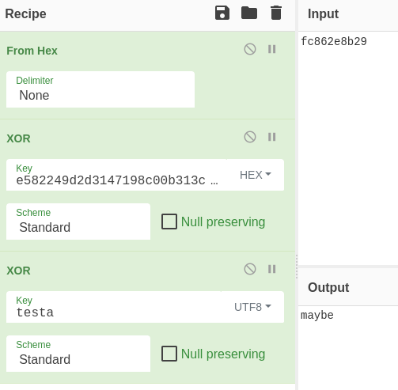

We can see that this returns the text ``maybe``, which should be the start of the password we are looking for. If we had been wrong about this we almost certainly would have gotten a bunch of garbage output.

### Solution 1 - Standard reused key attack

To summarize our strategy (per segment):
- Take the bytes which represent our current segment from each ciphertext
- XOR them with each other
- XOR the result with the corresponding bytes of our submitted password
    - This gives us the correct plaintext value for this segment
- Make a new request to the server using all of our uncovered segments, and some dummy text for the next segment

We will also assume that the segment size is 16. We could technically go the safer route of assuming a segment size of 1 byte (or even 1 bit), as any size will work with this strategy as long as the correct segment size is divisible by the one we end up using. This would be quite a bit slower though, and it will be quite obvious if we get it wrong anyway - since we will (very likely) get a bunch of garbage output that changes each time we run the script.

We could just do this in cyberchef, as we only need to solve 3 segments, but a programmatic solution is always nice. We also don't need to do this in frida as it's just talking to an API endpoint anyway, but it does save us from having to write the http request code, at the cost of having to write it in javascript:

``` javascript
// Settings
const cfbSegmentSize = 16;
const charset = "_abcdefghijklmnopqrstuvwxyz".split("");
const dummyChar = "-";

// Indices
const myPass = 0;
const correctPass = 1;

Java.perform(function() {
    let PasswordUtils = Java.use('org.mothra.smiley_day.PasswordUtils');
    let JavaString = Java.use('java.lang.String');


    function performRequest(password) {
        let javaString = JavaString.$new(password);
        return PasswordUtils.getEncryptedPasswordsFromCloud.call(PasswordUtils, javaString);
    }

    function toHex(string) {
        let hexString = "";
        for (let i = 0; i < string.length; i++) {
            hexString += string.charCodeAt(i).toString(16);
        }
        return hexString;
    }

    function fromHex(hexString) {
        let string = "";
        for (let i = 0; i < hexString.length / 2; i++) {
            String.fromCharCode(123);
            string += String.fromCharCode(parseInt(hexString.substring(i * 2, 2 + (i * 2)), 16));
        }
        return string;
    }

    function xor(hexString1, hexString2) {
        let result = "";

        for (let i = 0; i < hexString1.length / 2; i++) {
            let byte1 = parseInt(hexString1.substring(i * 2, 2 + (i * 2)), 16);
            let byte2 = parseInt(hexString2.substring(i * 2, 2 + (i * 2)), 16);

            let hexResult = (byte1 ^ byte2).toString(16);

            while (hexResult.length < 2) {
                hexResult = "0" + hexResult;
            }

            result += hexResult;
        }

        return result
    }

    function solveSegment(hashes, segment) {
        let start = 2 * segment * cfbSegmentSize;
        let end = Math.min(start + (cfbSegmentSize * 2), hashes[correctPass].length);

        let c1_xor_c2 = xor(hashes[correctPass].substring(start, end), hashes[myPass].substring(start, end));
        let hexResult = xor(c1_xor_c2, toHex(dummyChar.repeat(cfbSegmentSize)));

        return fromHex(hexResult);
    }

    function solveAll() {
        let dummyLength;
        let revealedSegments = "";
        let currentSegment = 0;
        let hashes;
        let currentGuess;

        do {
            dummyLength = cfbSegmentSize + (currentSegment * cfbSegmentSize) - revealedSegments.length;
            currentGuess = revealedSegments + dummyChar.repeat(dummyLength);

            hashes = performRequest(currentGuess);
            revealedSegments += solveSegment(hashes, currentSegment);

            console.log("Found so far: " + revealedSegments)
        } while (++currentSegment < Math.ceil(hashes[correctPass].length / 2 / cfbSegmentSize));

        return revealedSegments;
    }

    let password = solveAll();

    for (let i = 0; i < password.length; i++) {
        if (!charset.includes(password.charAt(i))) {
            console.log("\nGot the wrong password! Likely wrong segment size.")
            return;
        }
    }
    console.log("\nComplete key: " + password);
});
```

And as expected, running it reveals the correct password:


### Solution 2 - Pretty fast brute force

All of this math aside, a slightly slower solution is quite possible to discover on your own through a more practical approach. If you just mess around with AES/CFB-mode in [cyberchef](https://gchq.github.io/CyberChef/#recipe=AES_Encrypt(%7B'option':'Hex','string':'00000000000000000000000000000000'%7D,%7B'option':'Hex','string':'00000000000000000000000000000000'%7D,'CFB','Raw','Hex',%7B'option':'Hex','string':''%7D)&input=aGVsbG8gd29ybGQ) for example, you might notice that only the byte in the same position in the ciphertext changes when you change a byte in the plaintext (for short plaintexts of only 1 segment).

Logically, that means that if the character in any given position matches in the two ciphertexts we receive, then the character we had in that position in our submitted password must be the same in the correct password.

You may also have come across this if you tried the previous flag as the password several times. You might have noticed that a couple of bytes in the ciphertexts you receive will always be the same in both. This is because the characters in those positions are the same in both flags.

For example: say the correct password is ``hey``, and we send ``eee`` to the server. We might get something like this in return: 

``` json
{
   "supplied_password":"6ff16e",
   "correct_password":"62f172"
}
```

Keep in mind that the server returns a hex-string, so two characters equals one byte. We see that the second byte matches in both ciphertexts - ``f1``, meaning that ``e`` **must** be the second character of the correct password.

This means that we can brute force an entire segment very efficiently: by sending a request to the server filled with only ``a``s we uncover each location that should have an ``a``, we can then do the same for ``b``, then ``c`` and so on. Uncovering the entire segment with just 1 request per possible character.

We still need to handle one segment at a time like we did in our previous solution, but that shouldn't be too much of an issue.

An implementation of a brute force solution like this could be:

``` javascript
// Settings
const cfbSegmentSize = 16;
const charset = "_abcdefghijklmnopqrstuvwxyz".split("");
const dummyChar = "-";

// Indices
const myPass = 0;
const correctPass = 1;

Java.perform(function() {
    let PasswordUtils = Java.use('org.mothra.smiley_day.PasswordUtils');
    let String = Java.use('java.lang.String');


    function performRequest(password) {
        let javaString = String.$new(password);
        return PasswordUtils.getEncryptedPasswordsFromCloud.call(PasswordUtils, javaString);
    }

    function findPasswordLength() {
        let hashes = performRequest("");

        // We get a hex string in return, so 2 chars = 1 byte in the password
        return hashes[correctPass].length / 2;
    }

    function compareHashes(hashes, password, revealedChars, revealedCount) {
        let passwordChars = password.split("");
        let startHex;
        let endHex;

        let segmentStart = Math.floor(revealedCount / cfbSegmentSize) * cfbSegmentSize;
        let segmentEnd = Math.min(segmentStart + cfbSegmentSize, hashes[correctPass].length / 2);

        for (let i = segmentStart; i < segmentEnd; i++) {
            startHex = i * 2;
            endHex = startHex + 2;
            if (hashes[correctPass].substring(startHex, endHex) === hashes[myPass].substring(startHex, endHex)) {
                revealedChars[i] = passwordChars[i];
                revealedCount++;
            }
        }

        return revealedCount;
    }

    function bruteForce() {
        let length = findPasswordLength();
        let revealedChars = dummyChar.repeat(length).split("");
        let revealedCount = 0;
        let hashes;
        let currentGuess;
        let correctSegments;
        let segmentFinishedCount;


        for (let currentSegment = 0; currentSegment < Math.ceil(length / cfbSegmentSize); currentSegment++) {
            segmentFinishedCount = Math.min((currentSegment+1) * cfbSegmentSize, length);

            for (let i = 0; i < charset.length; i++) {
                correctSegments = revealedChars.join("").substring(0, currentSegment * cfbSegmentSize);
                currentGuess = correctSegments + charset[i].repeat(length - correctSegments.length);

                hashes = performRequest(currentGuess);
                revealedCount = compareHashes(hashes, currentGuess, revealedChars, revealedCount);

                console.log("Found so far: " + revealedChars.join(""));

                if (revealedCount === segmentFinishedCount) {
                    break;
                }
            }
        }

        return revealedChars.join("");
    }

    let password = bruteForce();

    if (password.includes(dummyChar)) {
        console.log("\nGot the wrong password! Likely wrong segment size.")
    } else {
        console.log("\nComplete key: " + password);
    }
});
```

And running this script looks like this:


Significantly slower than the traditional reused key attack, but still pretty fast. On the plus side it makes you look like a cool movie hacker, cracking the password one character at a time.

#### Why it works

This _is_ the same thing as the reused key attack of course; we're just ignoring the characters in our segment that don't match perfectly. This has no real practical use-case, but it's probably easier to spot on your own.

For completeness' sake, let's take a look at why this is just a special case of the reused key attack. Recall our key reuse formula for finding $P_1$:

$P_1 = C_1 \oplus C_2 \oplus P_2$

XOR is a byte-wise operation, so for the bytes that are equal in the ciphertexts we have:

$C_1 = C_2$

$P_1 = C_1 \oplus C_1 \oplus P_2$

If you XOR something with itself you get 0, so:

$P_1 = \enclose{updiagonalstrike}{\enclose{downdiagonalstrike}{C_1 \oplus C_1}} \oplus P_2$

$P_1 = P_2$

Meaning that for the cases where the ciphertexts are equal, the plaintexts must also be equal, and vice versa.

Another way to think of this is that when you use the same keystream, the relative difference between each byte in the two ciphertexts depends _only_ on the difference between each byte in the plaintexts. When the plaintexts are equal, the difference between them is 0, causing the difference between ciphertexts to also be 0.


### Revealing the plans

We enter the cracked password into the app:

``` bash
$ adb shell input text maybe_we_should_have_just_used_a_hash_instead
```

And clicking submit reveals the suspect's TODO list. The password itself is the flag, so this step is not strictly neccessary though.


Thank you for playing, see you next time!
